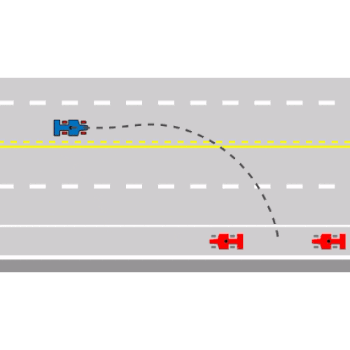
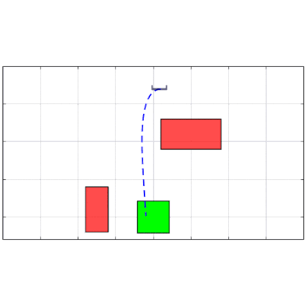
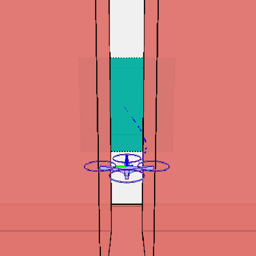

# Piecewise Affine Reach-avoid Computation (PARC)

PARC presents a parallelizable motion-planning framework for the reach-avoid problem in autonomous robotics, guaranteeing both safety and liveness. It models the planning dynamics as a parameterized piecewise-affine system, allowing for the computation of a continuum of feasible motion plans through a precise backward reachability analysis. The utility of PARC is demonstrated across various robotics systems, where it is benchmarked against leading reach-avoid methods, showcasing its superiority in low conservatism.

<p align="center">
  
  
  
 </p>

------- 
[**[Homepage]**](https://saferoboticslab.me.gatech.edu/research/parc/) &ensp; [**[Study Paper]**](https://arxiv.org/abs/2402.15604) &ensp; [**[Safe Robotics Lab @ GT]**](https://saferoboticslab.me.gatech.edu/)

-------

**Authors:** Long Kiu Chung* (lchung33@gatech.edu), Wonsuhk Jung* (wonsuhk.jung@gatech.edu), Chuizheng Kong (ckong35@gatech.edu), and Shreyas Kousik (shreyas.kousik@me.gatech.edu).

*Equal Contribution

-------
## Latest updates
- [2024/03/11] **v0.1.0**: Initial code and paper release
- [2024/03/18] **v0.1.1**: Added quad2d and quad3d examples

-------
## Setup Requirements
### Installation
To run this code, you will need
1. [MPT3 Toolbox](https://www.mpt3.org/)
2. [simulator](https://github.com/skousik/simulator) (Download and add to your path)

### Comparison Notes
To reproduce the comparison results shown in the paper, please navigate to the `demo/system_name/benchmark` (e.g., `demo/nearhover/benchmark`) folder.
1. For the comparison with [FasTrack](https://github.com/HJReachability/fastrack), we provide a pre-computed reachable set [here]() using Level-set Toolbox.
2. For the comparison with [NeuralCLBF](https://github.com/MIT-REALM/neural_clbf), we provide a pre-trained weight [here]() and corresponding simulated result [here]().
3. For the comparison with [RTD-quadrotor](https://github.com/roahmlab/RTD_quadrotor_DSCC_2019), we provide a pre-computed forward reachable set [here]().
4. To generate the comparison plots in the paper, please install [CORA2018](https://tumcps.github.io/CORA/pages/archive/v2018/index.html).

-------
## Navigating this Repo
### Tutorial
`demo` folder provides you a step-by-step guide how to write your own PARC algorithm via learning example of turtlebot 2D navigation and nearhover 3D navigation.

### Directory Structure
1. `agents`: Abstraction for the tracking model (e.g., Turtlebot)
2. `TrajectoryModel`: Abstraction for the planning model (e.g., Dubins Car)
3. `utils`: Collection of useful operations as visualization, set operation, sampling, that is agnostic to choice of tracking model and planning model.

-------
## 


-------
## Citation
Please cite [this paper](https://arxiv.org/abs/2402.15604) if you use `PARC` in an academic work:
```bibtex
@article{chung2024goal,
  title={Goal-Reaching Trajectory Design Near Danger with Piecewise Affine Reach-avoid Computation},
  author={Chung, Long Kiu and Jung, Wonsuhk and Kong, Chuizheng and Kousik, Shreyas},
  journal={arXiv preprint arXiv:2402.15604},
  year={2024}
}
```

